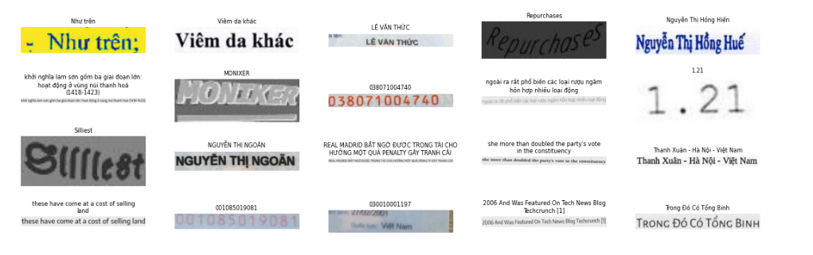
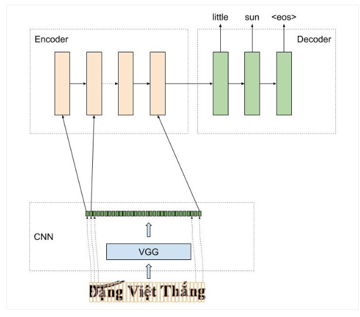
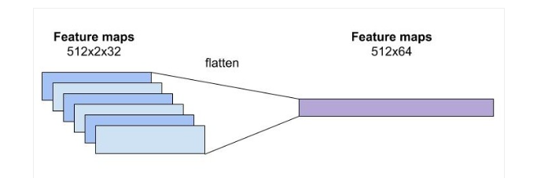
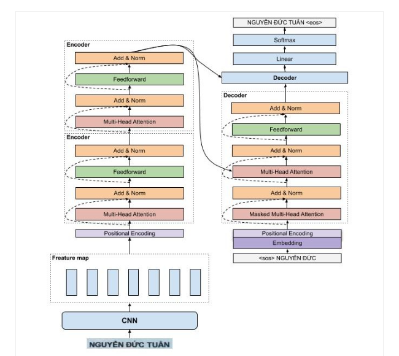

# VietOCR - Nhận dạng Tiếng Việt sử dụng mô hình Transformer và AttentionOCR

Phần kiến thức lý thuyết này mình tham khảo bài viết của anh Phạm Bảo Quốc ở đường [link](https://pbcquoc.github.io/vietocr/) sau. Các bạn có thể hiểu rõ hơn ở link này.

# Mô hình 

Mô hình VietOCR là sự kết hợp của mô hình CNN và mô hình Language Model (Seq2Seq và Transformer) để tạo thành mô hình giúp giải quyết bài toán OCR. 

# CNN của mô hình OCR

Mô hình CNN, dùng trong bài toán OCR nhận đầu vào là 1 ảnh , thông thường có kích thước với chiều dài lớn hơn nhiều so với chiều rộng. Do đó việc điều chỉnh tham số stride size  của tâng pooling là vô cùng quan trọng. Kích thước stride size của các lớp pooling cuối cùng thường được chọn là wxh = 2x1. Không thay đổi stride size phù hợp với kích thước ảnh sẽ dẫn tới kết quả tệ.
Đối với mô hình VGG, việc thay đổi pooling size khá dễ do kiến trúc đơn giản, tuy nhiên đối với mô hình phức tạp khác như resnet việc điều chỉnh tham số pooling size hơi phức tạp do một ảnh bị downsampling không chỉ bởi tầng pooling mà còn tại các tầng convolution khác

# AttentionOCR

AttentionOCR là sự kết hợp giữa mô hình CNN và mô hình Attention Seq2Seq. Cách hoạt động của mô hình này tương tự như kiến trúc của mô hình seq2seq trong bài toán dịch máy. Với bài toán dịch máy từ tiếng việt sang anh, chúng ta cần encode một chuỗi tiếng việt thành một vector đặc trưng, còn trong mô hình AttentionOCR, thì dữ liệu đầu vào này là một ảnh.
Một ảnh qua mô hình CNN, sẽ cho một feature maps có kích thước `channelxheightxwidth`, feature maps này sẽ trở thành đầu vào cho mô hình LSTM, tuy nhiên, mô hình LSTM chỉ nhận chỉ nhận đầu vào có kích thước là hiddenxtime_step. Một cách đơn giản và hợp lý là 2 chiều cuối cùng `heightxwidth` của feature maps sẽ được duổi thẳng. Feature maps lúc này sẽ có kích thước phù hợp với yêu cầu của mô hình LSTM.


Feature maps của mô hình CNN sau khi được flatten thì được truyền vào làm input của mô hình LSTM, tại mỗi thời điểm, mô hình LSTM cần dự đoán từ tiếp theo trong ảnh là gì.

# TransfomerOCR


Các bạn có thể tận dụng kiến trúc transformer thay cho mô hình LSTM để dự đoán từ tiếp theo trong ảnh. Chi tiết kiến trúc và cách hoạt động của mô hình transformer mình đã giải thích rất chi tiết tại [đây](https://pbcquoc.github.io/transformer/).

# Huấn luyện mô hình 
Huấn luyện mô hình AttenionOCR hay TransformerOCR hoàn toàn giống với luyện mô hình seq2seq, chúng đều sử dụng cross-entropy loss để tối ưu thay vì sử dụng CTCLoss như mô hình CRNN, tức là tại mỗi thời điểm mô hình dự đoán một từ sau đó so sánh với nhãn để tính loss và cập nhật lại trọng số của mô hình.

Với phân kiên thức về CTCLoss và mô hình CRNN, mình sẽ để link ở [đây](https://viblo.asia/p/tim-hieu-bai-toan-ocr-voi-crnn-va-ctc-loss-ocr-from-scratch-with-pytorch-p1-OeVKBA905kW) và sẽ viết documentation sau.

# Thư Viện VietOCR
Thư viện VietOCR được mình xây dựng với mục đích hỗ trợ các bạn có thể sử dụng để giải quyết các bài toán liên quan đến OCR trong công nghiệp. Thư viện cung cấp cả 2 kiến trúc AtentionOCR và TransformerOCR. Tuy kiến trúc TransformerOCR hoạt động khá tốt trong NLP, nhưng theo mình nhận xét thì độ chính không có sự cải thiện đáng kể so với AttentionOCR mà thời gian dự đoán lại chậm hơn khá nhiều.

Mình có cung cấp pretrained model được mình huấn luyện trên tập dữ liệu 10m ảnh để các bạn có thể sử dụng nhanh chóng trong các bài toán mới. Tuy nhiên, mình khuyến khích các bạn huấn luyện mô hình trên tập dữ liệu mới của bản thân nếu muốn sử dụng trong công nghiệp.

Để thử nghiệm nhanh chóng mô hình các bạn có thể tham khảo notebook tại [đây](https://colab.research.google.com/drive/1GVRKGFPsmq_xKJbOuSplrIDJZYp-IyzW?usp=sharing)

Ở phần tiếp theo, mình sẽ hướng dẫn các bạn cách tạo bộ dataset phù hợp với thư viện, sử dụng thư viện để huấn luyện trên dataset mới, thay đổi cách augmentate, dự đoán cho ảnh mới và một số lưu ý khi sử dụng thư viện.

# DATASET
Để huấn luyện mô hình các bạn cần chuẩn bị dữ liệu ít nhất là khoảng 3k mẫu, trong các dự án thực tế thì nên sử dụng 20k mẫu trở lên. Cấu trúc thư mục chứa dữ liệu
```python
├── img
│   ├── 00000.jpg
│   ├── 00001.jpg
├── train_annotation.txt # nhãn tập train 
└── val_annotation.txt # nhãn tập test
```
Dữ liệu file nhãn theo định dạng sau:
```python
path_to_file_name[tab]nhãn
img/74086.jpg   429/BCT-ĐTĐL
img/04225.jpg   Như trên;
img/97822.jpg   V/v: Duyệt dự toán chi phí Ban QLDA nhiệt điện 1 năm 2012 và
```
# Custom Augmentor
Mặc định, mô hình có sử dụng augmentation, tuy nhiên các bạn có thể cần augmentate theo cách khác nhau để đảm bảo tính biến dạng ảnh không quá lớn so với dữ liệu gốc. Do đó, thư viện cho phép các bạn tự định nghĩa augmentation như ví dụ dưới, và truyền vào lúc huấn luyện.
```python
from vietocr.loader.aug import ImgAugTransform
from imgaug import augmenters as iaa

class MyAugmentor(ImgAugTransform):
    def __init__(self):
        self.aug = iaa.GaussianBlur(sigma=(0, 1.0))
```

# Huấn Luyện
Để huấn luyện mô hình các bạn chỉ cần tạo được bộ dataset của mình, sau đó thay đổi các tham số quan trọng là có thể huấn luyện mô hình dễ dàng.

```python
from vietocr.tool.config import Cfg
from vietocr.model.trainer import Trainer

# Các bạn có thể chọn vgg_transformer hoặc vgg_seq2seq 
config = Cfg.load_config_from_name('vgg_transformer')

# Các bạn có thể thay đổi tập vocab của mình hoặc để mặc định vì tập vocab của mình đã tương đối đầy từ các kí tự rồi 
# lưu ý rằng các kí tự không có trong tập vocab sẽ bị lỗi
#config['vocab'] = 'tập vocab'

dataset_params = {
    'name':'hw', # tên dataset do bạn tự đặt
    'data_root':'./data_line/', # thư mục chứa dữ liệu bao gồm ảnh và nhãn
    'train_annotation':'train_line_annotation.txt', # ảnh và nhãn tập train
    'valid_annotation':'test_line_annotation.txt' # ảnh và nhãn tập test
}

params = {
         'print_every':200, # hiển thị loss mỗi 200 iteration 
         'valid_every':10000, # đánh giá độ chính xác mô hình mỗi 10000 iteraction
          'iters':20000, # Huấn luyện 20000 lần
          'export':'./weights/transformerocr.pth', # lưu model được huấn luyện tại này
          'metrics': 10000 # sử dụng 10000 ảnh của tập test để đánh giá mô hình
         }

# update custom config của các bạn
config['trainer'].update(params)
config['dataset'].update(dataset_params)
config['device'] = 'cuda:0' # device để huấn luyện mô hình, để sử dụng cpu huấn luyện thì thay bằng 'cpu'

# huấn luyện mô hình từ pretrained model của mình sẽ nhanh hội tụ và cho kết quả tốt hơn khi bạn chỉ có bộ dataset nhỏ
# để sử dụng custom augmentation, các bạn có thể sử dụng Trainer(config, pretrained=True, augmentor=MyAugmentor()) theo ví dụ trên.
trainer = Trainer(config, pretrained=True)

# sử dụng lệnh này để visualize tập train, bao gồm cả augmentation 
trainer.visualize_dataset()

# bắt đầu huấn luyện 
trainer.train()

# visualize kết quả dự đoán của mô hình
trainer.visualize_prediction()

# huấn luyện xong thì nhớ lưu lại config để dùng cho Predictor
trainer.config.save('config.yml')
```
# Inference
Sau khi huấn luyện mô hình các bạn sử dụng config.yml và trọng số đã huấn luyện để dự đoán hoặc chỉ sử dụng pretrained model của mình.

```python
from vietocr.tool.predictor import Predictor
from vietocr.tool.config import Cfg

# config = Cfg.load_config_from_file('config.yml') # sử dụng config của các bạn được export lúc train nếu đã thay đổi tham số  
config = Cfg.load_config_from_name('vgg_transformer') # sử dụng config mặc định của mình 
config['weights'] = './weights/transformerocr.pth' # đường dẫn đến trọng số đã huấn luyện hoặc comment để sử dụng pretrained model của mình
config['device'] = 'cuda:0' # device chạy 'cuda:0', 'cuda:1', 'cpu'

detector = Predictor(config)

img = './a.JPG'
img = Image.open(img)
# dự đoán 
s = detector.predict(img, return_prob=False) # muốn trả về xác suất của câu dự đoán thì đổi return_prob=True
```
