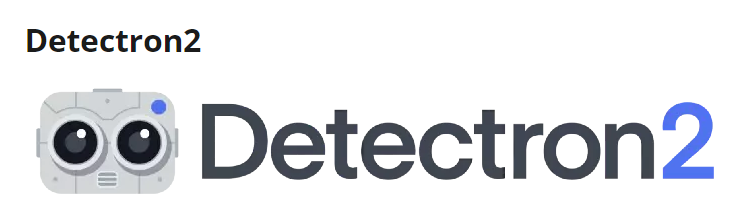
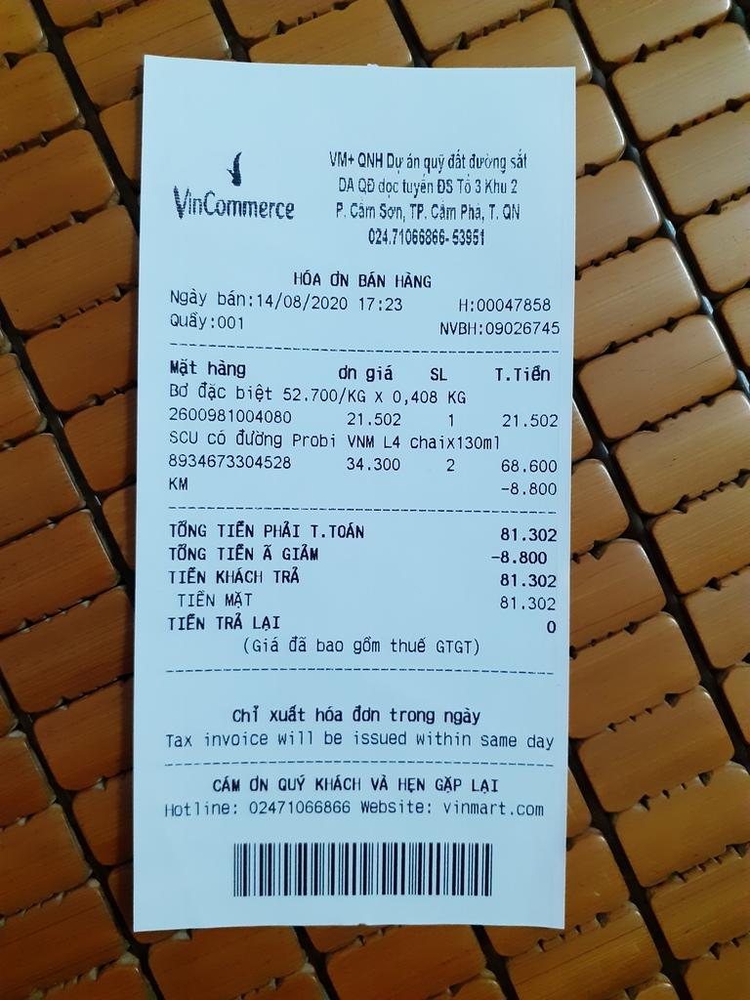
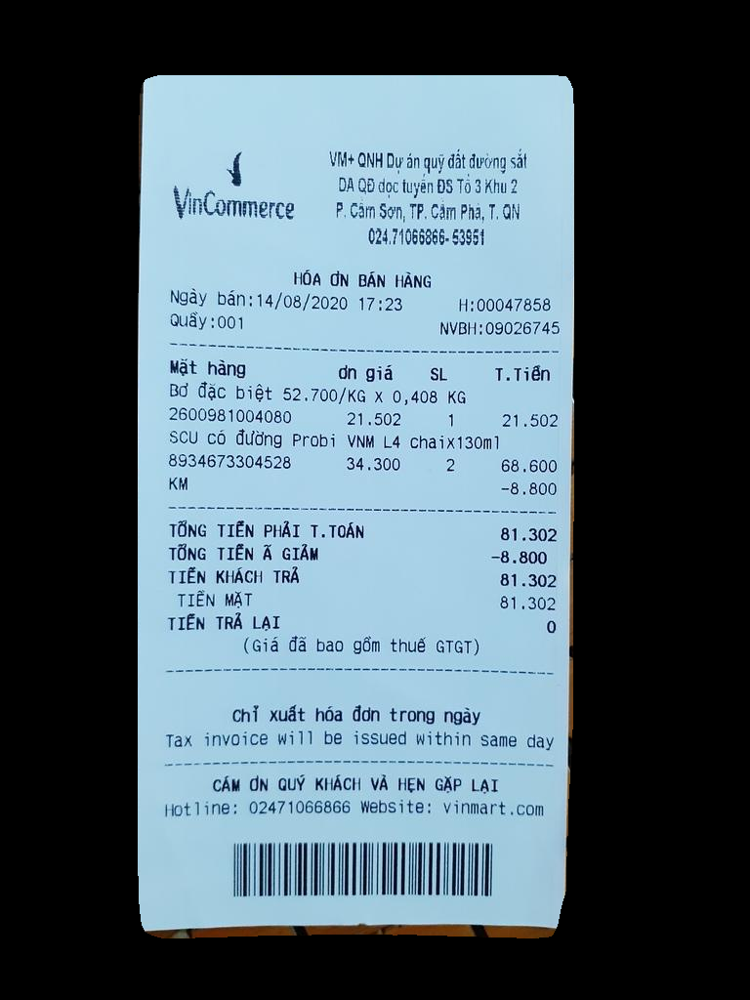

# TRAINING CUSTOM DATA WITH `DETECTRON2`


Trong phần này, chúng ta sẽ tìm hiểu về `Detectron2`, một framework để xây dựng bài toán Object Detection và Segmentation. Được phát triển bởi nhóm Facebook Research. Detectron2 sử dụng Pytorch.
Đặc biệt nhất, Detectron2 trở nên mạnh mẽ là bởi vì nó có pre-trained models có sẵn tại [Model Zoo](https://github.com/facebookresearch/detectron2/blob/main/MODEL_ZOO.md). Bạn có thể fine-tuning model một cách dễ dàng.

# Installing `Detectron2`

```python
!python -m pip install 'git+https://github.com/facebookresearch/detectron2.git'
```
Kiểm tra version hiện tại của `Detectron2`
```python
import torch, detectron2
!nvcc --version
TORCH_VERSION = ".".join(torch.__version__.split(".")[:2])
CUDA_VERSION = torch.__version__.split("+")[-1]
print("torch: ", TORCH_VERSION, "; cuda: ", CUDA_VERSION)
print("detectron2:", detectron2.__version__)
```
Tiếp theo chúng ta sẽ import các package cần thiết 
```python
# COMMON LIBRARIES
import os
import cv2

from datetime import datetime
from google.colab.patches import cv2_imshow

# DATA SET PREPARATION AND LOADING
from detectron2.data.datasets import register_coco_instances
from detectron2.data import DatasetCatalog, MetadataCatalog

# VISUALIZATION
from detectron2.utils.visualizer import Visualizer
from detectron2.utils.visualizer import ColorMode

# CONFIGURATION
from detectron2 import model_zoo
from detectron2.config import get_cfg

# EVALUATION
from detectron2.engine import DefaultPredictor

# TRAINING
from detectron2.engine import DefaultTrainer
```
# Download Custom data
Trong phần này, tôi sử dụng `Roboflow` để thực hiện gán nhãn cho dữ liệu cần segmentation.
Sau khi đã thực hiện gán nhãn và `export` dataset về dạng COCO. Chúng ta sẽ dowload dataset bằng đoạn code `python` sau đây:
```python
!pip install roboflow

from roboflow import Roboflow
rf = Roboflow(api_key="3iS5kQR332YwLQzD623r")
project = rf.workspace("segmentation-dzkqz").project("invoice_segmentation-xa7tc")
version = project.version(7)
dataset = version.download("coco-segmentation")
```
Phần code này sẽ được Roboflow cung cấp sẵn cho bạn khi bạn export dataset.
Trước khi `export`, mình đã thực hiện chia dữ liệu thành 3 tập: `train, test, valid`.

# Register Dataset

Để `Detectron2` hiểu được cách lấy tập dữ liệu của mình,  chúng ta cần đăng kí nó. 
`Đăng kí Bộ dữ liệu định dạng COCO`
Nếu tập dữ liệu của bạn là tệp json theo định dạng COCO, thì tập dữ liệu và siêu dữ liệu liên quan có thể được đăng kí dễ dàng bằng:
```python
DATA_SET_NAME = dataset.name.replace(" ", "-")
ANNOTATIONS_FILE_NAME = "_annotations.coco.json"
# TRAIN SET
TRAIN_DATA_SET_NAME = f"{DATA_SET_NAME}-train"
TRAIN_DATA_SET_IMAGES_DIR_PATH = os.path.join(dataset.location, "train")
TRAIN_DATA_SET_ANN_FILE_PATH = os.path.join(dataset.location, "train", ANNOTATIONS_FILE_NAME)

register_coco_instances(
    name=TRAIN_DATA_SET_NAME,
    metadata={},
    json_file=TRAIN_DATA_SET_ANN_FILE_PATH,
    image_root=TRAIN_DATA_SET_IMAGES_DIR_PATH
)

# TEST SET
TEST_DATA_SET_NAME = f"{DATA_SET_NAME}-test"
TEST_DATA_SET_IMAGES_DIR_PATH = os.path.join(dataset.location, "test")
TEST_DATA_SET_ANN_FILE_PATH = os.path.join(dataset.location, "test", ANNOTATIONS_FILE_NAME)

register_coco_instances(
    name=TEST_DATA_SET_NAME,
    metadata={},
    json_file=TEST_DATA_SET_ANN_FILE_PATH,
    image_root=TEST_DATA_SET_IMAGES_DIR_PATH
)

# VALID SET
VALID_DATA_SET_NAME = f"{DATA_SET_NAME}-valid"
VALID_DATA_SET_IMAGES_DIR_PATH = os.path.join(dataset.location, "valid")
VALID_DATA_SET_ANN_FILE_PATH = os.path.join(dataset.location, "valid", ANNOTATIONS_FILE_NAME)

register_coco_instances(
    name=VALID_DATA_SET_NAME,
    metadata={},
    json_file=VALID_DATA_SET_ANN_FILE_PATH,
    image_root=VALID_DATA_SET_IMAGES_DIR_PATH
)
```

Tiếp theo, chúng ta cần cofirm rằng custom dataset đã được đăng kí chính xác bằng cách sử dụng MetadataCatalog.

```python
[
    data_set
    for data_set
    in MetadataCatalog.list()
    if data_set.startswith(DATA_SET_NAME)
]
```

# Config and Training with Custom Dataset

Đầu tiên, chúng ta sẽ thực hiện việc config các tham số:
```python 
# HYPERPARAMETERS
ARCHITECTURE = "mask_rcnn_R_101_FPN_3x"
CONFIG_FILE_PATH = f"COCO-InstanceSegmentation/{ARCHITECTURE}.yaml"
MAX_ITER = 2000
EVAL_PERIOD = 200
BASE_LR = 0.001
NUM_CLASSES = 3

# OUTPUT DIR
OUTPUT_DIR_PATH = os.path.join(
    DATA_SET_NAME,
    ARCHITECTURE,
    datetime.now().strftime('%Y-%m-%d-%H-%M-%S')
)

os.makedirs(OUTPUT_DIR_PATH, exist_ok=True)
```
- Kiến trúc được lựa chọn là `mask_rcnn_R_101_FPN_3x`, phần này bạn có thể tham khảo trên Model Zoo.
- MAX_ITER: Số lần lặp tối đa trong quá trình training
- EVAL_PERIOD: Số lần mà model sẽ evaluate trên tập validation. Ví dụ: EVAL_PERIOD = 200, tức là cứ mỗi 200 iter, thì model sẽ evaluate trên tập test 1 lần.
- BASE_LR: Learning rate

```python
cfg = get_cfg()
cfg.merge_from_file(model_zoo.get_config_file(CONFIG_FILE_PATH))
cfg.MODEL.WEIGHTS = model_zoo.get_checkpoint_url(CONFIG_FILE_PATH)
cfg.DATASETS.TRAIN = (TRAIN_DATA_SET_NAME,)
cfg.DATASETS.TEST = (TEST_DATA_SET_NAME,)
cfg.MODEL.ROI_HEADS.BATCH_SIZE_PER_IMAGE = 64
cfg.TEST.EVAL_PERIOD = EVAL_PERIOD
cfg.DATALOADER.NUM_WORKERS = 2
cfg.SOLVER.IMS_PER_BATCH = 2
cfg.INPUT.MASK_FORMAT='bitmask'
cfg.SOLVER.BASE_LR = BASE_LR
cfg.SOLVER.MAX_ITER = MAX_ITER
cfg.MODEL.ROI_HEADS.NUM_CLASSES = NUM_CLASSES
cfg.OUTPUT_DIR = OUTPUT_DIR_PATH
```
- `cfg.merge_from_file`: Dòng này sẽ merge tất cả config trong file config được lấy từ Model Zoo vào biến `cfg`.
- `cfg.MODEL.WEIGHTS`:Cài đặt này chỉ định các trọng số đã được huấn luyện trước cho mô hình.
- `cfg.MODEL.ROI_HEADS.BATCH_SIZE_PER_IMAGE`: Dòng này thiết lập số lượng "regions of interest" (ROI) sẽ được xử lý trên mỗi hình ảnh trong quá trình huấn luyện. Giá trị 64 có nghĩa là đối với mỗi hình ảnh, mô hình sẽ lấy mẫu `64` ROI để sử dụng cho việc huấn luyện các ROI head.
- `cfg.DATALOADER.NUM_WORKERS = 2`: Dòng này xác định số lượng luồng (threads) để tải dữ liệu. Giá trị `2` có nghĩa là hai luồng sẽ được sử dụng để tải dữ liệu song song, giúp tăng tốc quá trình huấn luyện
- `cfg.SOLVER.IMS_PER_BATCH = 2`: Cài đặt này thiết lập số lượng hình ảnh sẽ được xử lý trong một lô (batch) khi huấn luyện. Giá trị 2 có nghĩa là hai hình ảnh sẽ được xử lý trong mỗi lượt tiến và lùi.
- `cfg.INPUT.MASK_FORMAT = 'bitmask`: Dòng này xác định định dạng của các mask trong tập dữ liệu của bạn. 'bitmask' có nghĩa là các mask là các hình ảnh nhị phân (0 và 1), trong đó 1 đại diện cho đối tượng và 0 đại diện cho nền.
  
```python
trainer = DefaultTrainer(cfg)
trainer.resume_or_load(resume=False)
trainer.train() 
```
# Save Config

```python 
f = open('/content/drive/MyDrive/Detectron2/config.yml', 'w')
f.write(cfg.dump())
f.close()
```
Lưu ý trong file `config.yml` sẽ chứa đường dẫn đến file weights model sau khi training. Chúng ta có thể sửa đường dẫn này để chúng phù hợp  với dự án của chúng ta.

# Load Model and Inference

```python
from detectron2.config import get_cfg
cfg = get_cfg()
cfg.merge_from_file("/content/drive/MyDrive/Detectron2/config.yml")
predictor = DefaultPredictor(cfg)
```
Load lại file config và thực hiện inference trên tấm ảnh mà bạn mong muốn. 

```python 
img = cv2.imread('/content/Invoice_Segmentation-7/train/mcocr_public_145013aaprl_jpg.rf.8333a8311a7c3c2ea2d96814cef24f88.jpg')
cv2_imshow(img)
outs = predictor(img)
mask = outs["instances"].pred_masks.to("cpu").numpy()[0]
import cv2
import numpy as np
binary_mask = mask.astype(np.uint8) * 255
binary_mask_3d = cv2.merge([binary_mask, binary_mask, binary_mask])
result = cv2.bitwise_and(img, binary_mask_3d)
cv2_imshow(result)
````

Kết quả :
**Trước**

** Sau**


**Trên đây là Document trong quá trình mình thực hiện project**