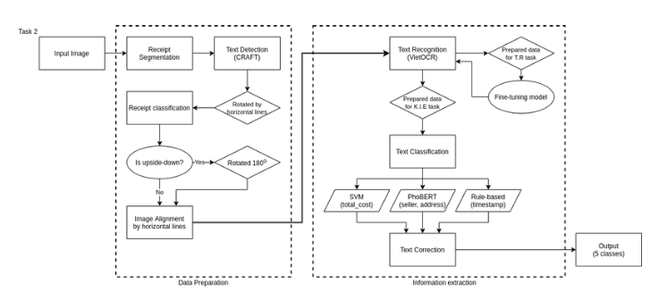

# Bài toán trích xuất thông tin từ hoá đơn
[Tài liệu tham khảo](https://viblo.asia/p/bai-toan-trich-xuat-thong-tin-tu-hoa-don-ORNZqd4nK0n)
Tập dữ liệu lấy từ tập dữ liệu MC_OCR. Cuộc thi bao gồm 2 bài toán đó là: Đánh giá chất lượng ảnh hóa đơn và trích xuất thông tin trên hóa đơn. Ở bài toán thứ nhất, chất lượng ảnh được đánh giá bằng cách lấy tỉ lệ giữa các dòng văn bản nhìn rõ và trên toàn bộ dòng văn bản. Còn bài toán thứ 2 là trích xuất được 4 trường thông tin từ 1 ảnh hóa đơn bao gồm: **SELLER**, **SELLER_ADDRESS**, **TIMESTAMP**, **TOTAL_COST**.
## I. Phương pháp

## II. Tiền xử lí dữ liệu
### 1. Loại bỏ background bằng phương pháp segmentation 
Cần phải loại bỏ background vì nó chiếm không gian lớn, điều này gây khó khăn cho quá trình nhân diện chữ trở nên khó khăn. Hơn nữa việc background chứa chứ sẽ khiến cho performance giảm.
Vì ảnh hoá đơn nhỏ và tách biệt với màu nền, đồng thời sát viền nên việc nhận diện và tách từng pixel chính xác và vô cùng quan trọng. Cho nên chúng ta sẽ dùng phương pháp segmentation để tách background ra khỏi ảnh.
Trong bài viết này, người ta tự `label ảnh` và sử dụng thư viện Detectron2 ở [link](https://viblo.asia/p/face-detection-on-custom-dataset-using-detectron2-in-google-colab-Az45bDrzZxY) dưới đây để thực hiện segmentation.
### 2. Phát hiện chữ và điều chỉnh ảnh (Text Detection và align image)
Sau khi đã segmentation, ảnh sẽ được crop theo $x_{min}, y_{min}, x_{max}, y_{max}$ của toàn bộ pixel postive(pixel khác pixel background). Về model `text-detection` ở đây người ta sử dụng `pretrained model`. Hiện nay có 2 model cho kết quả tốt trên tập benmark như `CRAFT` và `DB`. Với `CRAFT` cho độ chính xác cao, nhưng tốc độ chậm. Còn `DB` nhanh hơn nhưng độ chính xác thấp hơn.

Sau khi thực hiện `CRAFT` thu được các bouding box quanh các text. Sau đó tính `ratio` của các box dài để xác định độ nghiêng của các box và thực hiện xoay ảnh. 

### 3. Phân loại ảnh (Image Classification)
Xử lí vấn đề các ảnh hoá đơn bị ngược. Thực hiện việc tạo tập dữ liệu gồm 2 class : `ảnh xuôi` và `ảnh ngược` với tỉ lệ là `40 : 60`.
### 4. Nhận dạng chữ(Text Recognization)
Phần Text Recognization chỉ cần nhận diện 4 trường thông tin bao gồm: `ELLER`, `SELLER_ADDRESS`, `TIMESTAMP`, `TOTAL_COST`. Chúng ta có thể sử dụng thư viện `VietOCR` trên bộ dữ liệu tiếng việt. 
Dưới đây là link thư viện [VietOCR](https://github.com/pbcquoc/vietocr) cũng như là cách train model được anh Phạm Bảo Quốc hướng dẫn thông qua [notebook](https://github.com/pbcquoc/vietocr/blob/master/vietocr_gettingstart.ipynb).

### 5. Trích xuất thông tin 
Đây là bài toán con hay và lớn trong bài toán `scence text recognition` . Để hiểu hơn về bài toán này chúng ta sẽ tham khảo qua [bài viết](https://viblo.asia/p/information-extraction-trong-ocr-la-gi-phuong-phap-nao-de-giai-quyet-bai-toan-yMnKMjzmZ7P) này.

Ở trong bài viết trên thì mình có giải thích một paper có tên là PICK, tổng quan paper sử dụng dữ liệu về ảnh chứa text, text để nhận đầu vào. Sau khi lấy được đặc trưng về ngữ nghĩa của Text segment và Image segment thì cho qua mô hình Graph để có thể học được thêm đặc trưng về vị trí, mối tương quan giữa chúng. Output đầu ra của graph kết nối với đặc trưng của ảnh vs text ở trên để đưa vào module Decoder, module này gồm BiLSTM+CRF. Loss của mô hình này gồm 2 loss là $loss_{crf}$ và $loss_{graph}$.
Model này đạt được kết quả tốt trên tập SROI2019. Tuy nhiên tác giả có thử nghiêm trên tập dữ liệu này thì cho kết quả không tốt do BTC đã label sai một số chỗ. 

`Sau đây là phần trích ý tưởng của tác giả`
> Sau đó bọn mình đã lựa chọn dùng mô hình phân loại. Trở thành bài toán phân loại text thành 5 lớp **SELLER, SELLER_ADDRESS, TIMESTAMP, TOTAL_COST và OTHER**. Sự khó khăn của phương pháp này là label cho nhãn **OTHER** không được BTC cung cấp và bọn mình đã tự xây dụng tập dữ liệu bằng cách sau: Dùng model **CRAFT** để nhận được box chứa text, sau đó tính **IOU** giữa box này và box được BTC label, ngưỡng lớn hơn 0.1 bọn mình sẽ lấy label giống với label của BTC, ngược lại sẽ label cho text đó là **OTHER**. Từ đó bọn mình có được tập dữ liệu để huấn luyện mô hình phân loại, sau khi phân loại 1 model cho cả 5 lớp thì kết quả cho ra không tốt lắm, nhất là bị nhầm lần rất nhiều giữa tập **Other** và **Total_cost**. Sau đó bọn mình đã đưa ra giải pháp sử dụng phân loại theo cụm, theo đó cụm đầu tiên sẽ gốm **SELLER, SELLER_ADDRESS và OTHER**, cụm thứ 2 chỉ có 2 class là **TOTAL_COST và OTHER** và về **TIMESTAMP** mình sử dụng regex. Về cụm thứ 1, gồm các text dài nên mình sử dụng **VnCoreNLP+PhoBert** cho kết quả khá cao và mình thử nghiệm thì hấu như đều bắt được hết trường **SELLER và SELLER_ADDRESS **. Cụm thứ 2 mình sử dụng **Tf-idf+SVM** để phân loại 2 label TOTAL_COST và OTHER vì 2 label này có sự không rõ ràng nên việc đưa mô hình phức tạp như PhoBert không cho kết quả cao, thay vì đó sử dụng SVM cho kết quả tốt hơn. Về TIMESTAMP mình sử dụng regex bắt form ngày tháng năm để tìm ra text chứa những form đó, điều này có thể gây sai khi hóa đơn đấy có nhiều ngày giờ, nhưng phần lớn các hóa đơn được giải quyết.
