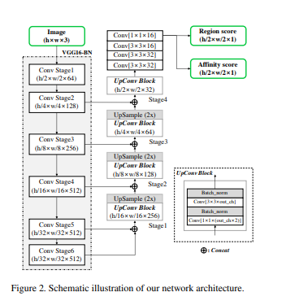
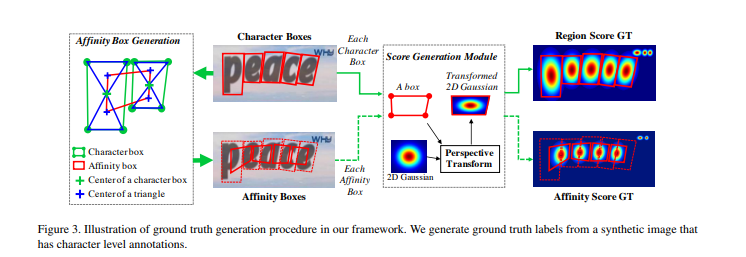
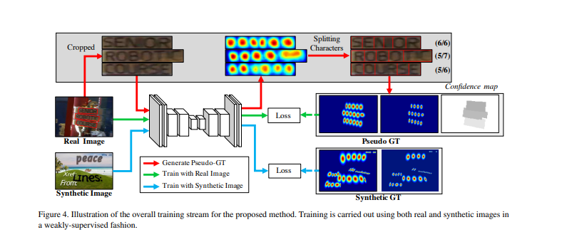
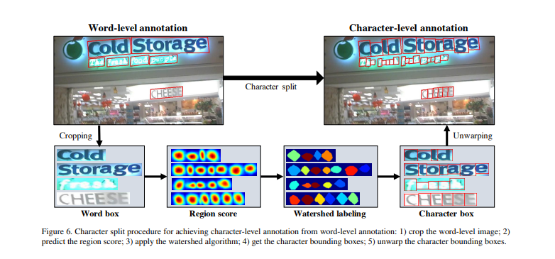
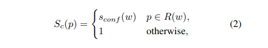
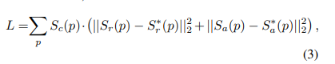
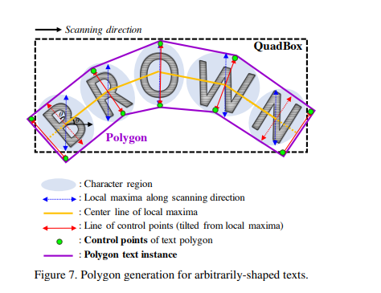

- [CRAFT FOR TEXT DETECTION](#craft-for-text-detection)
  - [1. Architecture](#1-architecture)
  - [2. Training](#2-training)
    - [2.1 Ground Truth Label Generation](#21-ground-truth-label-generation)
    - [2.2 Weakly-Supervised Learning](#22-weakly-supervised-learning)
    - [3. Inference](#3-inference)
# CRAFT FOR TEXT DETECTION
Để phục vụ cho project, hôm nay chúng ta sẽ tìm hiểu về `CRAFT` cho bài toán `Text Detection`.
Phần lý thuyết và các ý tưởng chính, mình tham khảo ở [paper](https://arxiv.org/pdf/1904.01941v1) này nhé. 

Các phương pháp phát hiện văn bản trong ảnh dựa trên mạng neuron đã xuất hiện gần đây và đưa ra những kết quả tích cực. Các phương pháp trước đây được huấn luyện với các bouding box gây ra những hạn chế trong việc nhận dạng những văn bản có hình dạng bất kì trong ảnh.
Các nhà phát triển `CRAFT` đề xuất một phương pháp mới bằng việc phát hiện các kí tự trong ảnh và tìm ra mối liên kết giữa các kí tự đó.

Mình sẽ bỏ qua các phần phụ trước đó để đi thẳng vào phần phương pháp của bài báo trên.

## 1. Architecture

CRAFT sử dụng một mạng Convolution network với VGG-16 làm back-bone, ngoài ra còn sử dụng thêm các lớp skip connection ở phần decoding. Đầu ra cuối cùng sẽ là 2 score maps: *region score* và *affinity score*. 

## 2. Training 
### 2.1 Ground Truth Label Generation
Với từng bức ảnh training, chúng tôi sẽ generate ground truth label cho `region score` và `affinity score`.

- `region score` biểu diễn cho xác suất 1 pixel là tâm của 1 kí tự
- `affinity score` biểu diễn cho xác suất trung tâm của khoảng cách giữa 2 kí tự.

Không giống như binary segmentation map, dán nhãn từng pixel một cách rời rạc. Ở đây tác giả sẽ mã hoá xác suất của tâm kí tự bằng Gaussian heatmap để  có thể học được cả `region score`  và  `affinity score`.

Trong bài báo này, người ta sử dụng các bước sau để ước lượng và generate ground truth cho cả `region score` và `affinity score`:

- `Step 1`: Chuẩn bị một Gaussian map đẳng hướng 2 chiều.
- `Step 2`: Tính toán perspective transform giữa Gaussian map region và từng character box. 
- `Step 3`: Chuyển đổi Gaussian map về dạng box area.

Với ground truth của `affinity score`, `affinity box` được định nghĩa là các character box liền kề. Với mỗi character box, chúng ta sẽ xác định tâm của 2 tam giác trên và dưới như Figure3. Sau đó, với các cặp character box liền kề, một `affinity box` được tạo ra bằng cách đặt tâm của tam giác trên và dưới làm các góc của hộp.

### 2.2 Weakly-Supervised Learning
Với các `real image`  trong tập dữ liệu thường các các chú thích ở cấp độ từ (word-level annotations). Chúng ta sẽ tạo ra các character box từ mỗi word-level annotation bằng cách giám sát yếu (weakly-supervised) được tóm tắt trong Figure4.
 

Khi cung cấp một real image với word-level annotations, mô hình sẽ cố gắng  dự đoán  charater region score của các cropped image để tạo ra các character-level bouding boxes.
Để phản ánh mức độ tin cậy của dự đoán, giá trị confidence map trên mỗi word box được tính toán theo tỉ lệ: số lượng kí được dự đoán / số lượng kí tự thực tế. Giá trị  confidence map này được sử dụng làm trong số trong quá trình training.

Hình 6 mô tả quá trình phân tách kí tự. Đầu tiên các bouding boxes của 1 từ được cắt ra từ ảnh ảnh gốc. 
Sau đó  mô hình sẽ dự đoán  `region score`. Tiếp theo, Thuật toán Watershed được sử dụng để tạo ra các character bouding boxes bao phủ các vùng. Cuối cùng toạ độ của các character box được chuyển đổi lại thành toạ độ ảnh gốc bằng phép biến đổi ngược từ bước `cropping`. 
Các ground truth giả định (pseudoGTs) cho `region score` và `affiniity score` được generate từ các bước trong  `Figure3`.
Khi training mô hình bằng weakly-supervised, chúng  ta buộc phải training bằng pseudoGTs. Nếu mô hình được đào tạo với các `region score` không chính xác, đầu ra dễ bị mờ trong các vùng kí tự. Để ngăn vấn đề này, chúng ta sẽ đo chất lượng của các pseudo-GT do mô hình tạo ra nhờ độ dài của từ được cung cấp trong các tập dữ liệu.

Với một word-level annotations sample `w` trong tập training. 
Ta có: $R(w), l(w)$ lần lượt là bouding box region và word length  của sample `w`. Thông qua quá trình phân tách kí tự, ta có thể thu được các character bouding box ước tính và độ dài kí tự tương ứng $l^c(w)$. Confidence score $S_{conf}(w)$ cho sample $w$ được tính như sau:

$S_{conf}(w) = \frac{l(w) - min(l(w), |l(w) - l^c(w)|)}{l(w)}$

Confidence map của từng pixel được tính như sau:

Hàm Loss được định nghĩa như sau:

Trong đó:

- $S_r(p)$ là `region score` dự đoán tại pixel p
- $S^*_r(p)$ là ground truth của `region score` tại pixel p
- $S_a(p)$ là `affiniity score` dự đoán tại pixel p
- $S^*_a(p)$ là ground_truth `affiniity score` tại pixel p

Hàm Loss này bao gồm 2 loại loss:
1. **Loss cho region score**: Đo lường sự khác biết giữa `region score` dự đoán và ground truth `region score`.
2. **Loss cho affinity score**: Đo lường sự khác biệt giữa `affinity score` dự đoán và ground truth `affinity score`.

### 3. Inference
Quá trình inference của CRAFT (Character Region Awareness for Text detection) bao gồm các bước chính để biến các đầu ra dự đoán thành các hộp giới hạn (bounding boxes) ở cấp độ từ hoặc ký tự, và có thể là các đa giác để xử lý văn bản cong. Dưới đây là giải thích chi tiết:
1. **Dự đoán ban đầu**
CRAFT dự đoán hai bản đồ xác suất cho mỗi ảnh:

- $S_r$: Điểm số vùng ký tự (Region Score), cho biết xác suất một pixel là trung tâm của một ký tự.
- $S_a$: Điểm số liên kết (Affinity Score), cho biết xác suất một pixel là trung tâm của khoảng cách giữa hai ký tự liền kề.

2. **Bước tiền xử lí**
Để tạo ra các hộp giới hạn cấp độ từ, quá trình tiền xử lý được thực hiện thông qua các bước sau:

- Khởi tạo một bản đồ nhị phân 
M phủ toàn bộ ảnh và ban đầu gán giá trị 0 cho tất cả các pixel.
- Đối với mỗi pixel $p$ nếu `region score` $S_r(p) > \tau_r$ hoặc $S_a(p) > \tau_a$ thì gán giá trị  1 cho M(p), trong đó $\tau_r$ là ngưỡng của `region score` và $\tau_a$ là ngưỡng của `affinity score`.

3. **Gán nhãn cho các thành phần liên thông (CCL)**
Sau khi tạo ra bản đồ nhị phân M, thực hiện quá trình gán nhãn các thành phần liên thông (Connected Component Labeling - CCL) để nhóm các vùng liên kết với nhau thành các blob tương ứng với các từ.  
4. **Tạo QuadBox** 

- Đối với mỗi blob, tìm một hình chữ nhật quay với diện tích nhỏ nhất bao quanh blob đó. Quá trình này có thể được thực hiện bằng các hàm như `connectedComponents `và `minAreaRect` trong OpenCV.
- Tạo các hộp giới hạn từ (QuadBox) từ các blob tương ứng với từ hoặc cụm từ được phát hiện.
  
CRAFT có ưu điểm là không cần các bước hậu xử lý phức tạp như Non-Maximum Suppression (NMS). Do các blob đã được tách biệt rõ ràng bằng CCL, hộp giới hạn cho mỗi từ đơn giản được định nghĩa là một hình chữ nhật bao quanh toàn bộ blob đó.
5. **Xử lý văn bản cong**
Đối với các văn bản cong, quá trình tạo đa giác để bao quanh vùng văn bản được thực hiện như sau:

- Tìm các đường cực đại cục bộ trong các vùng ký tự theo hướng quét, được minh họa bằng các mũi tên màu xanh lam.
- Đặt chiều dài của các đường cực đại bằng với chiều dài lớn nhất trong số chúng để đảm bảo kết quả đa giác cuối cùng không bị méo.
- Kết nối tất cả các điểm trung tâm của các đường cực đại để tạo thành đường trung tâm (center line), được hiển thị bằng màu vàng.
- Sau đó, các đường cực đại được quay sao cho vuông góc với đường trung tâm để phản ánh góc nghiêng của các ký tự (mũi tên đỏ).
- Các điểm cuối của các đường cực đại này là các điểm kiểm soát (control points) của đa giác. Để bao phủ toàn bộ vùng văn bản, các đường cực đại ngoài cùng được di chuyển ra ngoài dọc theo đường trung tâm.
